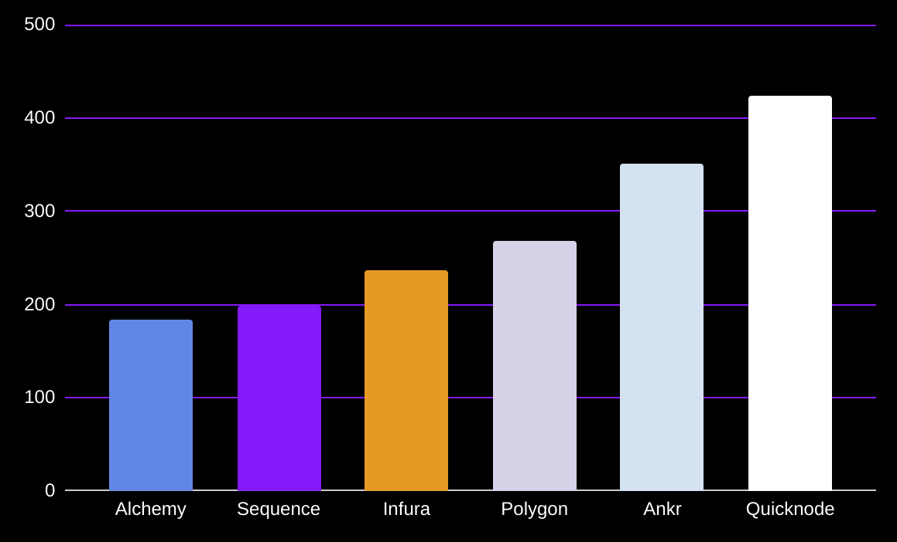

# rpc-benchmark
An RPC call comparison across infrastructure stacks using Polygon network

## APIs Used
- sequence 
- alchemy
- infura 
- quicknode
- polygon
- ankr

### methodology
- 10 wallet addresses
- 10 requests per wallet rpc call on native provider balance

### results
```
┌──────────────────────────────┬──────────────────────────────┐
│ API                          │ Time (ms)                    │
├──────────────────────────────┼──────────────────────────────┤
│ Sequence                     │ 199.41                       │
├──────────────────────────────┼──────────────────────────────┤
│ Alchemy                      │ 183.65                       │
├──────────────────────────────┼──────────────────────────────┤
│ Infura                       │ 236.74                       │
├──────────────────────────────┼──────────────────────────────┤
│ Quicknode                    │ 424.3                        │
├──────────────────────────────┼──────────────────────────────┤
│ Polygon                      │ 268.84                       │
├──────────────────────────────┼──────────────────────────────┤
│ Ankr                         │ 351.34                       │
└──────────────────────────────┴──────────────────────────────┘

```

### Graph Comparison: Token Balance RPC Call
